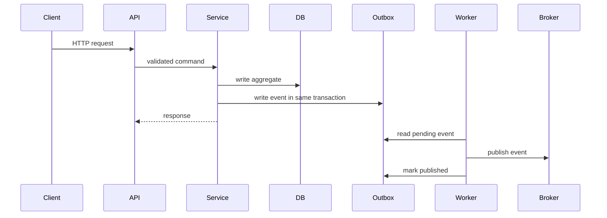

# Architecture

## Modules

- `app/api`: HTTP endpoints and request validation.
- `app/services`: business workflows for auth, cart, checkout, orders, payments, inventory, delivery and notifications.
- `app/models`: SQLAlchemy persistence models.
- `app/events`: domain/integration events, event bus, outbox/inbox, publishers, subscribers and handlers.
- `app/workers`: long-running worker entrypoints.
- `app/admin`: SQLAdmin back office.
- `app/observability`: logging, metrics, rate limiting and security middleware.

## Request Flow

## Order Lifecycle

`created -> awaiting_payment -> paid -> processing -> packed -> shipped -> delivered`

Terminal statuses: `cancelled`, `refunded`, `failed`.

## Payment Lifecycle

`PaymentCreated -> PaymentAuthorized -> PaymentCaptured`

Failure and recovery paths: `PaymentFailed`, `PaymentRefunded`, `WebhookPaymentReceived`.

## Inventory Lifecycle

`InventoryReserved -> InventoryCommitted` after payment.

Cancellation/failure path: `InventoryReleased`.

Stock alerts: `StockChanged -> LowStockDetected`.

## Production Dependencies

- Managed PostgreSQL for transactional data.
- Managed Redis for cache/rate limiting extensions.
- Managed RabbitMQ or compatible broker for integration events.
- Object storage for images.
- CDN for product images.
- Secret manager for credentials.
- Centralized logs, metrics, tracing and alerting.
