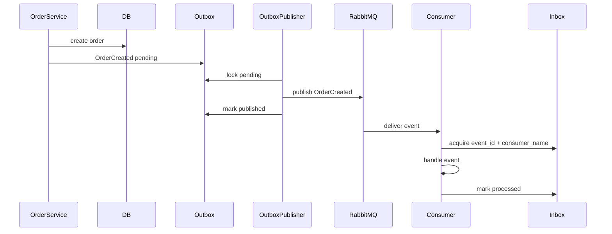

# Events

## Structure

Event modules are under `backend/app/events`:

- `domain_events`: internal business events.
- `integration_events`: broker-facing events for external systems.
- `event_bus`: local dispatch and handler registry.
- `handlers`: email, inventory, integrations, logging and external sync handlers.
- `publishers`: local outbox publisher and RabbitMQ publisher.
- `subscribers`: local and RabbitMQ subscribers.
- `outbox`: reliable publish storage.
- `inbox`: consumer deduplication storage.
- `schemas`: event envelope, versioning and validation.

## Envelope

Every event has:

- `event_id`
- `event_name`
- `event_kind`
- `version`
- `correlation_id`
- `causation_id`
- `aggregate_type`
- `aggregate_id`
- `occurred_at`
- `payload`
- `metadata`

## Domain Events

User: `UserRegistered`, `UserEmailVerified`, `UserPasswordResetRequested`, `UserBlocked`.

Cart: `CartCreated`, `CartItemAdded`, `CartItemRemoved`, `CartUpdated`, `CartExpired`.

Order: `OrderCreated`, `OrderConfirmed`, `OrderCancelled`, `OrderPaid`, `OrderPaymentFailed`, `OrderProcessingStarted`, `OrderPacked`, `OrderShipped`, `OrderDelivered`, `OrderRefunded`.

Payment: `PaymentCreated`, `PaymentAuthorized`, `PaymentCaptured`, `PaymentFailed`, `PaymentRefunded`, `WebhookPaymentReceived`.

Inventory: `InventoryReserved`, `InventoryReservationFailed`, `InventoryReleased`, `InventoryCommitted`, `StockChanged`, `LowStockDetected`.

Delivery: `ShipmentCreated`, `ShipmentTrackingUpdated`, `ShipmentDelivered`, `ShipmentFailed`.

Notification: `EmailSendRequested`, `SmsSendRequested`, `NotificationSent`, `NotificationFailed`.

## Reliability

- Outbox writes events in the same DB transaction as business changes.
- Outbox publisher sends broker events and marks them `published`.
- Failed publish attempts move to `retrying`, then `dead_letter`.
- Inbox stores `(event_id, consumer_name)` to protect each consumer group from duplicate processing.
- Event transitions are logged and counted in metrics.

## Event Sequence

